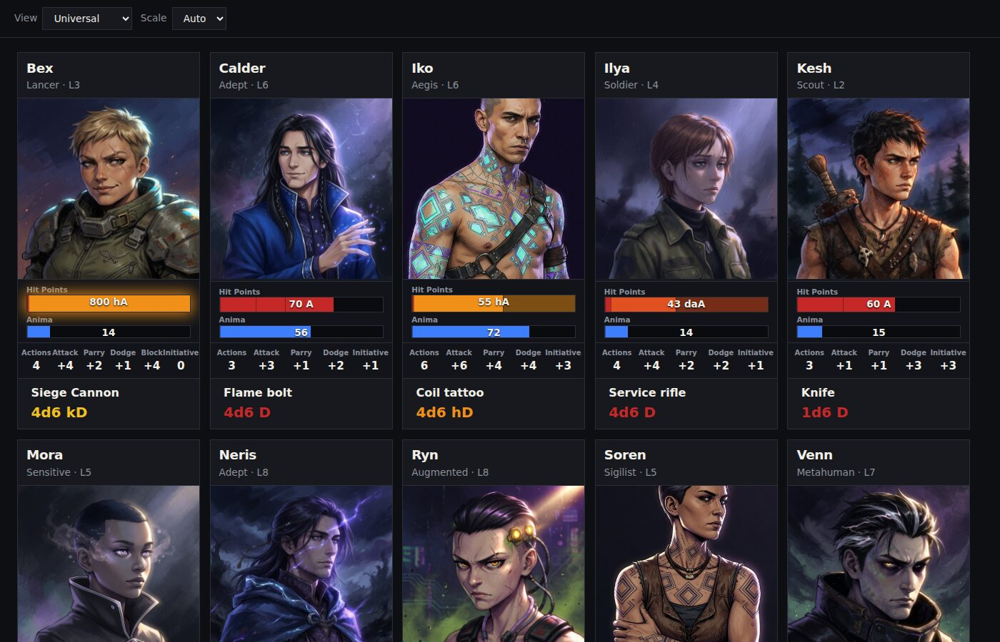

# Lex

Lex is a playable universal RPG system (characters, combat, armor, damage) and a tablet roster/sheet. Other games map in as **adapters** (data), not as extra engines. Two people at the same table can use two adapters.

Harm is a single ratio to a reference unit. SI prefixes (`D`/`A`, `hD`/`hA`, …) are how large armor and damage are written. Expanding a ×100 suit into 77 000 “hit points” on a sheet built for tens or hundreds is the wrong representation — keep the prefix. See `docs/universal-system.md` and `docs/glossary.md`.

## Run

```bash
uv sync --group dev
uv run lex serve
```

Open http://127.0.0.1:8000 — roster of sample characters on the **Universal** adapter.



```bash
uv run lex test
```

## Packs vs ingest

- `data/packs/` — catalog the engine loads. `universal/` is the native pack; `u-simplified/` is a sheet adapter. Other packs live here too.
- `data/ingest/` — local notes and book links (git tracks only `data/ingest/README.md`)

Do not commit material you do not have the right to distribute. Details: `docs/ingest.md`.

## Contributions

Pull requests must not add text, art, names, or stats copied from a game you do not own the rights to ship. Mapping notes for other publishers’ games stay in local `data/ingest/` (gitignored except `data/ingest/README.md`). The public packs in this repo are original.

## License

Apache 2.0 for the software. Sample characters and the universal adapter are original to this repo.
